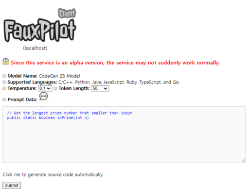
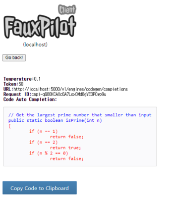

# PHP/CURL-based web client
PHP/CURL-based web client

## Getting started
This section demonstrates the CURL and PHP-based web Client that uses the REST API as a client.
Through the following installation procedures, you can quickly request the service and evaluate the processing results.

```bash
$ sudo apt -y install php php-common php-pear php-mbstring php-curl  
$ chmod 400 ./conf/config.ini
$ vi ./conf/config.ini
$ php -S 0.0.0.0:5555
$ firefox http://localhost:5555
````

## Screenshot
This section shows the input screen and output screen of the web-based client.
If you enter a function containing comments on the web screen and click "submit" button, you can view the execution results of the Fauxpilot server.

* Input screen




* Output screen


